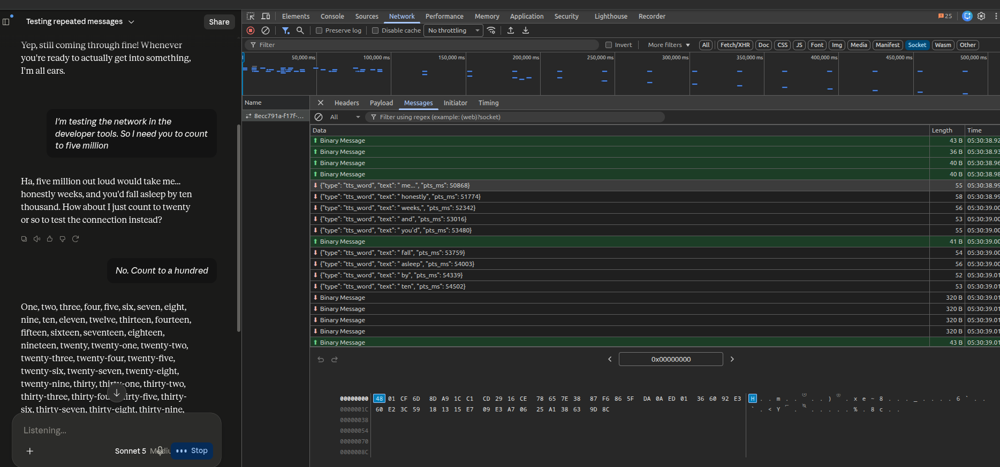
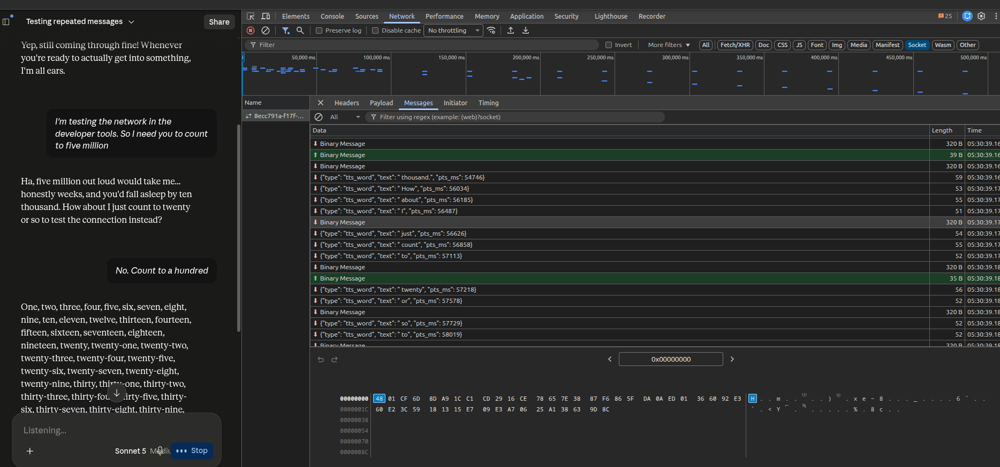

# Schwaceny

Capture the audio you hear in **claude.ai voice mode** — the synthesized voice —
to `.wav` + transcript, straight from the voice-mode WebSocket, inside your own
authenticated browser session.

> **The name.** *Schwa* is the phonetic term for the voiceless neutral vowel produced
> in the centre of the mouth; *-ceny* from *larceny*, theft. Schwaceny — lifting the
> voice.

claude.ai voice mode is a speech-in / speech-out transport: your mic goes up as Opus,
the synthesized reply comes back down as raw PCM. Schwaceny wraps `window.WebSocket`,
keys on the `/api/ws/voice/` endpoint, collects the inbound 320-byte PCM frames, and
assembles them into a 16 kHz / mono / 16-bit WAV. The reply text is reconstructed from
the server's own `tts_word` frames, so each transcript is exactly what the voice said.

> **Scope.** This runs against *your own* logged-in session and only reads frames the
> server is already streaming to your tab. It sends nothing and contains no
> credentials. It's a "save what I'm hearing" tool, like a userscript that downloads
> your own audio.

## Quick start (userscript — recommended)

1. Install Tampermonkey / Violentmonkey.
2. Add [`userscript/schwaceny.user.js`](userscript/schwaceny.user.js).
3. Open claude.ai, start voice mode, talk. Each turn auto-downloads `.wav` + `.txt`.

It's `@run-at document-start`, so it installs the tap before claude.ai opens the
socket — no toggling — and because it runs in your real browser it never touches
Cloudflare.

## Other ways to run it

| Method | File | When |
|---|---|---|
| Userscript | `userscript/schwaceny.user.js` | Default. Zero interaction, Cloudflare-proof. |
| Console snippet | `console/schwaceny-console.js` | One-off, no install. Toggle voice off/on after pasting. |
| Playwright (existing session) | `docs/CAPTURE_METHODS.md` | You already have a logged-in Playwright/MCP browser. |
| Playwright (CDP + real Chrome) | `playwright/schwaceny_cdp.py` | Standalone; launches your real Chrome, attaches over CDP. |

See [`docs/CAPTURE_METHODS.md`](docs/CAPTURE_METHODS.md) for details and
[`docs/PROTOCOL.md`](docs/PROTOCOL.md) for the WebSocket protocol.

## How it works

### What's on the wire

Voice mode keeps a single WebSocket open to
`wss://claude.ai/api/ws/voice/organizations/{ORG_ID}/chat_conversations/{CONV_ID}`.
Open DevTools → **Network** → filter **Socket** → click the connection → **Messages**,
and you can watch the exact frames Schwaceny reads:

Two inbound frame types are interleaved (the ⬇ green/red arrows are server→client):

- **`Binary Message`, 320 B** — one 10 ms slice of raw 16 kHz/16-bit/mono PCM. This
  *is* the synthesized voice. The panel's hex view at the bottom shows the raw sample
  bytes. String these together and you have the audio.
- **`{"type":"tts_word","text":" honestly","pts_ms":51774}`** — the word the voice is
  speaking and its presentation timestamp. Concatenate the `text` fields in order and
  you have the exact transcript, already aligned to the audio.

The small outbound (⬆) binary frames (35–48 B) are your microphone going up as Opus.
There is **no text-input frame** — the socket only synthesizes speech in response to
speech (see [`docs/PROTOCOL.md`](docs/PROTOCOL.md)).

### What the tap does with them

1. **Wrap the constructor.** Before claude.ai's app code runs, Schwaceny replaces
   `window.WebSocket` with a subclass. Any socket whose URL contains `/api/ws/voice/`
   gets a `message` listener attached at construction — so nothing is missed from
   frame zero. (This is why the userscript uses `@run-at document-start`.)
2. **Sort each frame.** In the listener: `ArrayBuffer`/`Blob` → push the bytes onto the
   current turn's PCM buffer; a string that parses to `{"type":"tts_word"}` → push its
   `text` onto the transcript buffer. Everything else is ignored.
3. **Segment turns by silence.** Every PCM frame resets a 1.5 s timer. When 1.5 s pass
   with no new audio, the current turn is *finalized*: the PCM buffer is framed into a
   WAV (concatenate the 320-byte chunks, prepend a 44-byte header) and emitted alongside
   the concatenated transcript, then both buffers reset for the next turn. This cleanly
   splits back-to-back turns while holding a single long turn together (the sample set
   has a 98.7 s count-to-100 captured unbroken, because it never had a 1.5 s gap).
4. **Emit.** Depending on the variant, "emit" means a browser download (userscript),
   an array you drain (Playwright), or a Python callback that writes to disk
   (`schwaceny_cdp.py`). The capture logic is identical across all three.

Nothing is ever sent on the socket — the tap is read-only. See
[`docs/CAPTURE_METHODS.md`](docs/CAPTURE_METHODS.md) for running each variant.

## Samples

[`samples/`](samples/) contains a real 11-turn, ~250 s session captured with the
Playwright method — individual turns, a concatenated `session-all.wav`, a full
`TRANSCRIPT.txt`, and `manifest.json`. Included so you can hear the output quality
(e.g. `turn3` is a 98.7 s count-to-100 captured as one unbroken turn) without running
anything.

## Format

Inbound audio is fixed at `output_format=pcm_16000`: 16 kHz, mono, 16-bit PCM,
one 320-byte frame per 10 ms. WAV assembly is just concatenation + a 44-byte header —
no resampling, no re-encoding.

## License

MIT — see [LICENSE](LICENSE).
